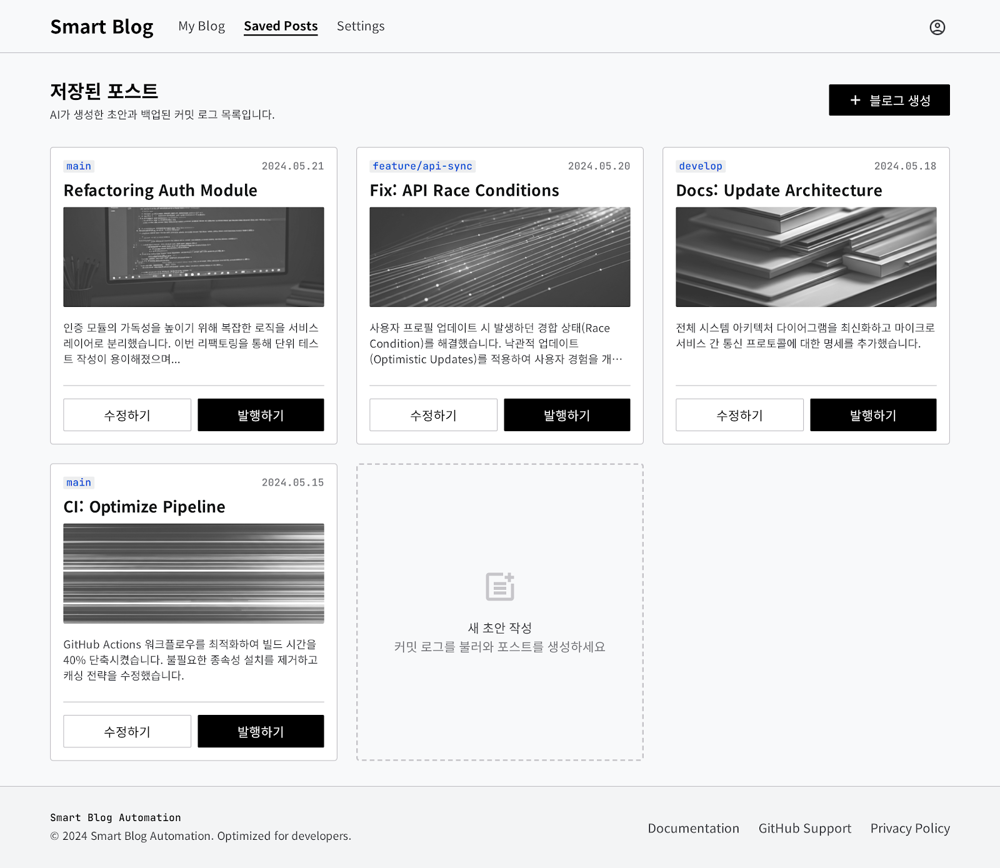
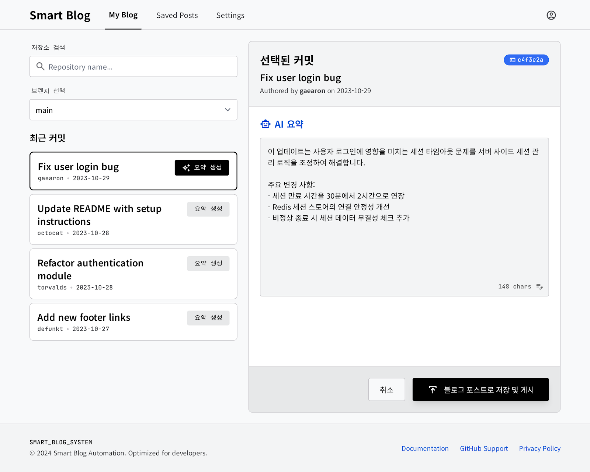

# [학부명_실명] - Commit-to-Blog 서비스 MVP 구현 및 UI/UX 개선

## 완료 작업 목록

- 선택한 저장소의 브랜치를 조회하고 최근 커밋 목록을 불러오는 흐름을 구현했습니다.
- 단일 커밋뿐 아니라 여러 커밋을 선택해서 하나의 블로그 초안으로 생성할 수 있도록 백엔드 파이프라인을 확장했습니다.
- OpenAI 기반 초안 생성과 fallback 초안 생성을 모두 지원하도록 구현했습니다.
- 생성된 초안을 미리보기하고, Saved Posts에 저장하고, 이후 수정하고, 내부 블로그에 발행하는 전체 흐름을 연결했습니다.
- Saved Posts 목록, 게시글 수정 화면, 내부 블로그 목록/상세 화면을 연결했습니다.
- 주요 프론트엔드 컴포넌트에 단위 테스트를 추가했습니다.
- 프론트엔드 레이아웃을 여러 차례 리팩터링하면서 네비게이션, 간격, 타이포 계층, 카드 구조를 정리했습니다.
- 작업 체크리스트 문서를 `checklist.md`로 정리했습니다.

### 동작 화면 스크린샷

- 참고 이미지 1: 
- 참고 이미지 2: 
- 실제 동작 화면은 PR 업로드 시 최신 캡처본으로 추가 첨부 예정입니다.

## Workflow 완성

### 내가 사용한 workflow 단계

1. 엔드유저 시나리오를 먼저 체크리스트로 정리해서 구현 범위를 고정했습니다.
2. 체크리스트를 기준으로 MVP 범위를 다시 잘라서, 저장소/브랜치/커밋 조회, 초안 생성, 저장, 수정, 발행 흐름으로 분해했습니다.
3. 기능을 한 번에 구현하지 않고, 백엔드 파이프라인, 프론트 연결, 수정/발행 흐름, 테스트, UI 개선을 각각 feature commit 단위로 나눠서 진행했습니다.
4. 각 커밋 요청 시에는 repo-local `pre-commit-review` skill을 사용해서 변경 범위를 점검하고, 점수와 이슈를 확인한 뒤 커밋했습니다.
5. 작업하면서 불편했던 점은 `AGENTS.md` workflow 규칙에 다시 반영해서, 다음 작업 때 바로 개선된 흐름을 사용할 수 있도록 조정했습니다.

### 분석/설계를 꼼꼼하게 하기 위해 적용한 장치

- 구현 전에 `checklist.md`로 요구사항을 고정했습니다.
- “기능 연결”과 “UI 개선”을 분리해서 생각했습니다.
- 외부 연동은 항상 fallback 경로까지 포함해서 설계했습니다.
- PR과 커밋을 기능 단위로 쪼개서 전체 맥락을 잃지 않도록 했습니다.

### Skill / hook 개념 적용

- 사용한 Skill:
  - `pre-commit-review`: 커밋 전에 코드 범위와 품질을 점검하는 용도로 사용했습니다.
- workflow에 적용한 hook 성격의 규칙:
  - 사용자가 커밋을 요청하면 자동으로 review를 먼저 수행하고, 통과 시 커밋하도록 연결했습니다.
  - 변경이 충분히 응집되어 있으면 별도 요청 없이도 커밋 가능하도록 workflow 규칙을 보완했습니다.

### workflow에서 발견한 문제점과 개선

- 문제점 1: 처음에는 기능 구현과 UI 수정을 한 흐름에서 너무 크게 다루려고 해서 변경 범위가 쉽게 커졌습니다.
  - 개선: feature commit을 더 잘게 나누고, PR에는 전체 맥락을 다시 정리하는 방식으로 조정했습니다.
- 문제점 2: UI 문제를 “예쁘게 바꾸기”로 뭉뚱그려 질문하니 결과가 모호했습니다.
  - 개선: navigation, spacing, typography, grid처럼 설계 요소별로 나눠서 질문했습니다.
- 문제점 3: 반복되는 작업 규칙이 명시되어 있지 않아서 매번 같은 판단을 다시 해야 했습니다.
  - 개선: `AGENTS.md`에 auto-commit workflow 규칙을 추가했습니다.

## 분석 & 설계 과정

1. 먼저 엔드유저 시나리오를 `checklist.md`로 정리해서 기능 범위를 고정했습니다.
2. 이후 전체 기능을 한 번에 만들지 않고, 저장소/브랜치/커밋 조회, 초안 생성, 저장, 수정, 발행으로 나눠 MVP 흐름을 설계했습니다.
3. 백엔드에서는 GitHub API 연동과 AI 생성이 실패하거나 키가 없을 때를 대비해 demo/fallback 경로를 같이 두었습니다.
4. 데이터 모델은 여러 커밋을 한 게시글에 연결할 수 있도록 source commit 목록 중심으로 생각했습니다.
5. 프론트엔드는 처음에는 MVP 연결을 우선으로 구현하고, 이후 실제 제품처럼 보이도록 레이아웃과 UI를 반복적으로 다듬었습니다.
6. UI를 바꿀 때는 한 번에 크게 뒤엎기보다, 네비게이션 구조, spacing, typography, grid 구성처럼 문제를 나눠서 단계적으로 수정했습니다.

## 서비스 구조

### 전체 구조

- `frontend`
  - Vite + React 기반 SPA입니다.
  - `src/app`에는 route-level page를 두고,
  - `src/features`에는 도메인별 `api`, `queries`, `mutations`, `types`, `components`를 분리했습니다.
- `backend`
  - Express 기반 API 서버입니다.
  - GitHub 데이터 조회, AI 초안 생성, 게시글 저장/수정/발행 API를 담당합니다.
  - Prisma 모델을 통해 post, source commit 등의 데이터를 저장합니다.

### FE 역할

- 저장소/브랜치/커밋 선택 UI를 렌더링합니다.
- 선택한 commit SHA 목록을 기준으로 초안 생성 API를 호출합니다.
- 생성된 draft를 preview로 보여주고 저장 요청을 보냅니다.
- Saved Posts, Edit, Published Blog 화면에서 데이터를 조회하고 사용자 액션을 연결합니다.

### BE 역할

- GitHub 토큰이 있으면 실제 저장소/브랜치/커밋 정보를 조회합니다.
- 토큰이 없으면 demo 데이터를 반환해서 UI 흐름이 끊기지 않도록 합니다.
- OpenAI API 키가 있으면 실제 초안을 생성하고, 없거나 실패하면 fallback 초안을 생성합니다.
- 저장된 post와 source commit 관계를 관리하고, draft/published 상태를 전환합니다.

### API 호출 흐름

1. FE가 저장소 목록/브랜치 목록/커밋 목록 API를 호출합니다.
2. 사용자가 커밋을 선택하면 FE가 `generate-post` 계열 API로 commit SHA 배열을 전달합니다.
3. BE는 선택된 commit 정보를 조합해서 AI 초안을 만들고 FE에 반환합니다.
4. FE는 preview를 보여준 뒤 저장 요청을 보냅니다.
5. 이후 Saved Posts에서 조회, 수정, 발행 API를 호출합니다.
6. Published Blog 화면에서는 발행된 글만 별도 조회해서 렌더링합니다.

### 내가 구현하면서 이해한 핵심 포인트

- 이 서비스의 핵심은 “GitHub commit context를 blog draft로 변환하는 파이프라인”입니다.
- 그래서 UI보다 먼저 중요한 것은:
  - commit selection 상태 관리
  - multi-commit 순서 보존
  - AI/fallback 이중 경로
  - post와 source commit 연결 구조
- 프론트는 이 파이프라인을 사용자가 조작하는 인터페이스이고, 백엔드는 그 흐름을 안정적으로 처리하는 역할이라고 이해했습니다.

## 가장 막혔던 순간

가장 막혔던 부분은 프론트엔드 UI였습니다. 기능은 연결되어 있었지만 화면이 “블로그 서비스”처럼 보이지 않고, 카드와 텍스트가 서로 너무 붙어 있어서 전체 위계가 무너져 있었습니다.

이때 AI에게는 한 번에 “예쁘게 바꿔줘”라고 묻기보다, `navigation을 더 상용 블로그 서비스처럼`, `proximity rule로 간격을 다시 잡아줘`, `typography hierarchy를 정리해줘`, `more grid-like minimal UI로 바꿔줘`처럼 문제를 잘게 나눠서 요청했습니다.

그 결과, 단순 색상 변경보다 중요한 것이 정보 구조, 그룹 간 간격, 제목/설명/메타의 역할 분리라는 점을 확인했고, 헤더 단순화, grid 레이아웃 조정, 타이포 계층 정리 쪽으로 해결 방향을 잡을 수 있었습니다.

## 새로 알게 된 것

- 여러 커밋을 하나의 글로 묶을 때는 단순히 SHA 배열만 넘기는 것이 아니라, 선택 순서를 보존하는 구조가 중요하다는 점을 배웠습니다.
- AI 기능은 “정상 경로”만 설계하면 금방 깨지기 때문에, API 키 누락과 외부 연동 실패를 대비한 fallback 설계가 실제로 매우 중요하다는 점을 다시 확인했습니다.
- 프론트엔드 UI 문제는 색상이나 컴포넌트 개수보다도, 정보 위계와 proximity가 더 큰 영향을 준다는 것을 체감했습니다.
- 테스트도 페이지 전체보다 핵심 상호작용 컴포넌트부터 먼저 잡는 편이 범위를 통제하기 좋았습니다.

## 다르게 한다면?

- 처음부터 UI를 크게 바꾸려고 하기보다, 초기에 wireframe 수준으로 정보 구조를 먼저 고정한 뒤 스타일을 얹을 것입니다.
- AI에게도 “전체를 예쁘게”가 아니라 “지금 이 화면에서 가장 깨진 규칙 하나만 고쳐줘”처럼 더 작게 쪼개서 물어볼 것입니다.
- CSS가 한 파일에 커질 때 바로 분리하지 못했는데, 다음에는 레이아웃/컴포넌트/타이포 스타일을 초반부터 나눠서 관리할 것입니다.
- 실제 PR용 스크린샷도 마지막에 몰아서 찍지 않고, 기능 단위 완료 시점마다 바로 정리할 것입니다.

## 기타 확인해야 할 것

- `checklist.md`는 저장소 루트에 포함되어 있습니다.
- `AGENTS.md`는 저장소 루트에 포함되어 있습니다.
